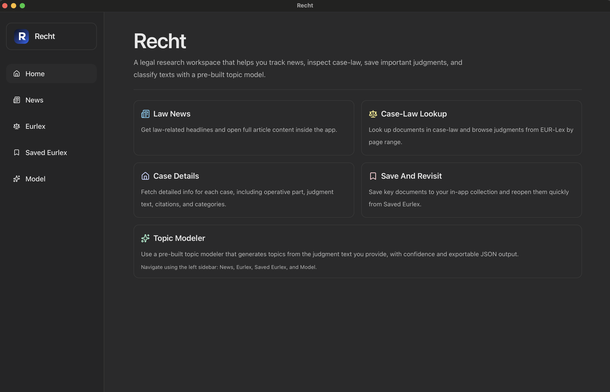

<div align="center">
  <p>Recht</p>
</div>

<div align="center">
  
</div>

<br>

<p> Installation instructions : </p>

After dragging the app to Applications , it may not open since this isn't a notarized/signed app. Run the following in the terminal

```bash
xattr -dr com.apple.quarantine "/Applications/Recht.app" 
```

For testing out Recht quickly , it's also on the web at - https://recht.vishalvenkat.dev
