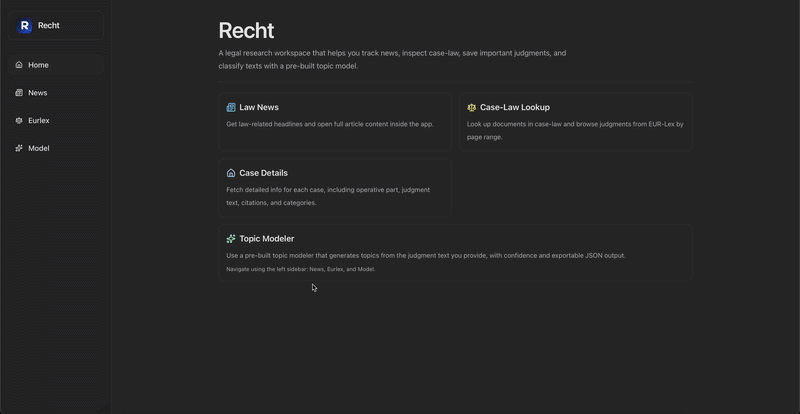

<div align="center">
  <p>Recht</p>
</div>

<div align="center">
  
</div>

---

## Installation Instructions

After downloading the dmg from `releases` and  dragging the app to Applications , it may not open since this isn't a notarized/signed app. Run the following in the terminal

```bash
xattr -dr com.apple.quarantine "/Applications/Recht.app" 
```
---

For testing out Recht quickly , it's also on the web at - https://recht.vishalvenkat.dev


For my topic modelling , the documentation to the website is at - https://topicmodeldocs.vishalvenkat.dev

---

## Data Sources

- News articles: [`Above the Law (ATL)`](https://abovethelaw.com)
- Court cases: [`EUR-Lex`](https://eur-lex.europa.eu/search.html?DTS_SUBDOM=EU_CASE_LAW&DTS_DOM=EU_LAW&CASE_LAW_SUMMARY=false&type=advanced&qid=1773609077250)

---
